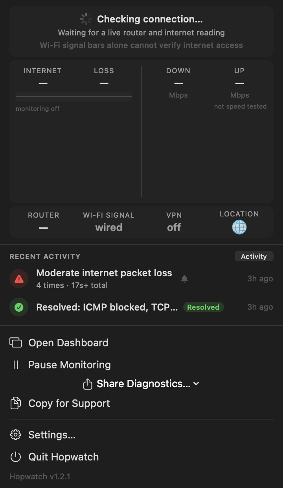

<div align="center">


# Hopwatch

**The zero-jargon network monitor and diagnostic companion for macOS.**  
*Know instantly whether an issue is your Wi-Fi, your router, or your internet provider.*

[](https://github.com/godigi/hopwatch/releases/latest)
[](https://github.com/godigi/hopwatch/actions/workflows/bats.yml)
[](https://github.com/godigi/hopwatch/actions/workflows/shellcheck.yml)
[](https://github.com/godigi/hopwatch#requirements)
[](./LICENSE)

<br />

<p align="center">
  <a href="https://github.com/godigi/hopwatch/releases/latest">
    
  </a>
</p>

<p align="center">
  
</p>

<p align="center">
  <a href="docs/SCREENSHOTS.md"><b>📸 Explore the Full UI Screenshot Gallery (Light & Dark Mode) ➔</b></a>
</p>

</div>

### Highlights

| Feature | Description |
|:---|:---|
| 🎯 **Hop Attribution Chain** | Pinpoints root cause at a glance across `[Mac] ──► [Router] ──► [ISP]`. |
| ⚡ **Live Menu Bar Telemetry** | Monospace live RTT (`● 18ms`), packet loss, and link health directly in your menu bar. |
| 🔍 **40+ Diagnostic Checks** | Bufferbloat, path MTU, captive portals, Wi-Fi sticky APs, DNS hijacking, and DHCP lease expiry. |
| 🛡️ **Zero Jargon & Redacted Sharing** | Human-readable diagnoses with actionable fixes; 1-click sanitized reports safe for support tickets. |
| 📈 **Per-Network Baselines** | Profiles each Wi-Fi and wired network to flag latency spikes and regressions. |
| 🔄 **Continuous Background Monitoring** | LaunchAgent watcher & recorder detect flapping outages and track downtime across reboots. |

---

## Quick Install

### Option A: 1-Line Instant Installer (Mac App + CLI) ⚡ *(Recommended)*
Run this in your terminal. It installs `Hopwatch.app` to `/Applications`, links the `hopwatch` (and `netdiag`) command line tool to your PATH, clears Gatekeeper quarantine, and launches the menu bar app:
```sh
curl -fsSL https://raw.githubusercontent.com/godigi/hopwatch/main/install-app.sh | bash
```

### Option B: Download for macOS (DMG)
Download the latest **[Hopwatch.dmg](https://github.com/godigi/hopwatch/releases/latest)**, open it, and drag `Hopwatch.app` into your Applications folder.

> [!TIP]
> **First Launch on macOS:** If macOS displays an *"unidentified developer"* or *"cannot verify"* message, simply **Right-Click (Control-Click) Hopwatch.app ➔ Open**, or run:
> ```sh
> xattr -cr /Applications/Hopwatch.app
> ```

### Option C: Homebrew Cask
```sh
brew tap godigi/hopwatch https://github.com/godigi/hopwatch.git
brew install --cask hopwatch
```

### Option D: Terminal CLI Only
```sh
curl -fsSL https://raw.githubusercontent.com/godigi/hopwatch/main/install.sh | bash
```
Or with Homebrew bash bootstrap: `curl -fsSL https://raw.githubusercontent.com/godigi/hopwatch/main/install.sh | bash -s -- --prefix ~/.local/bin`

---

## Overview

Hopwatch runs a battery of macOS-native checks (interface, WiFi, gateway,
DNS, traceroute, bufferbloat, PMTU, mtr, IPv6, VPN, TCP reach, WiFi scan +
disconnect history, NTP drift, ARP, DHCP, local traffic attribution, plus
NAT/WAN topology — dual-WAN, double-NAT, UPnP/NAT-PMP), writes a
timestamped JSON + human log, then
prints a **Diagnosis** section that names a likely culprit with evidence
and a recommendation. It also tracks a rolling baseline so intermittent
regressions ("WiFi RSSI dropped from -55 to -78 since yesterday", "gateway
RTT is 4× the 30-day median") get caught the next time you run it.

Independent probes run as parallel background jobs. A default run is
bound by the speed test — about 55 s with Ookla's `speedtest`, roughly
twice that with the `speedtest-cli` fallback, which is why the installer
prefers Ookla. `--no-speed` brings it under 35 s and `--quick` under 8 s.
Pass `--progress` (or use the app) to watch each check land rather than
a spinner.

On a **metered link** — a phone's hotspot, or USB/Bluetooth tethering —
the speed test is skipped by default and `MET-1` says so, because it
would spend hundreds of megabytes of a cellular allowance to answer a
question you did not ask. Pass `--speed` to run it anyway.

It also watches **what your own Mac was doing** while it measured. A
bufferbloat grade of D with a backup uploading at 40 Mb/s is not the same
finding as a grade of D on an idle link — the first is the backup, the
second is the router — and `TR-1` names the process rather than letting
the report blame your router for your own transfer.

## Why

When the internet is flaky you don't have time to run `ping`, `traceroute`,
`dig`, `ipconfig`, `wdutil`, `mtr`, `system_profiler`, and `speedtest`
separately and correlate the outputs by hand. Hopwatch does that and tells
you where to look first. For *intermittent* problems — where the failure
window is gone by the time you can investigate — `hopwatch --watch` or the
`--install-watcher` LaunchAgent runs it on a cron so the baseline catches
the regression on the next pass.

### Hopwatch vs. Traditional Tools

| Capability | `ping` / `traceroute` | `speedtest-cli` | `mtr` | **Hopwatch** |
|:---|:---:|:---:|:---:|:---:|
| **Root-Cause Attribution** (Wi-Fi vs Router vs ISP) | ❌ | ❌ | ❌ | ✅ **Automatic Culprit Detection** |
| **Loaded Bufferbloat Grading** (A–F) | ❌ | ❌ | ❌ | ✅ **Loaded vs Idle Jitter** |
| **Wi-Fi Radio Health & Sticky APs** | ❌ | ❌ | ❌ | ✅ **RSSI, SNR, PHY & Overlaps** |
| **Per-Network Historical Baseline** | ❌ | ❌ | ❌ | ✅ **Scored vs Median History** |
| **Safe Sanitized Sharing** | ❌ | ❌ | ❌ | ✅ **Masks IPs, SSIDs, MACs** |
| **Continuous Menu Bar Monitor** | ❌ | ❌ | ❌ | ✅ **Native SwiftUI App** |
| **Zero Jargon Plain-English Fixes** | ❌ | ❌ | ❌ | ✅ **Clear Next Steps** |

If you'd rather read the script before piping it to a shell — a reasonable
habit — clone instead:

```sh
git clone https://github.com/godigi/hopwatch.git
cd hopwatch
./install.sh
```

Run from inside a clone, `install.sh` points the symlink at that clone and
never touches the network.

<details>
<summary>Options and uninstall</summary>

```sh
install.sh --prefix DIR    # where to put the symlink
                           # default: /usr/local/bin if writable, else ~/bin
install.sh --no-brew       # skip the bash 5 bootstrap
install.sh --uninstall     # remove the symlink; keeps the checkout and ~/hopwatch
```

When piping, flags go after `-s --`:

```sh
curl -fsSL https://raw.githubusercontent.com/godigi/hopwatch/main/install.sh \
  | bash -s -- --prefix ~/.local/bin
```

`HOPWATCH_SRC` overrides the checkout location, `HOPWATCH_REPO` the clone URL.

To remove Hopwatch entirely:

```sh
hopwatch --uninstall-watcher            # if you installed the LaunchAgent
~/.local/share/hopwatch/install.sh --uninstall
rm -rf ~/.local/share/hopwatch ~/hopwatch
```

*(Legacy `netdiag` alias and `~/net-diag` directories are cleaned up automatically).*

</details>

### Requirements

macOS 14 Sonoma or newer on Apple Silicon or Intel. CLI requires bash 5 (the installer bootstraps it automatically via Homebrew).

### Usage

```
hopwatch [TARGET] [--quick] [--gping] [--no-bufferbloat] [--speed]
                  [--json] [--quiet] [--expert] [--log PATH] [--progress]
                  [--baseline | --no-baseline]
hopwatch --mtu-only               # just the path-MTU probe
hopwatch --wifi-only              # just the WiFi checks
hopwatch --speed-only             # just the speed test, recorded to history
hopwatch --dns-only               # just DNS and resolver checks
hopwatch --bufferbloat-only       # just the loaded-vs-idle latency test
hopwatch --ping-only              # just gateway and internet latency/loss
hopwatch --redact --json          # safe to paste into a ticket
hopwatch --watch[=SEC]            # foreground loop, every SEC (default 300)
hopwatch --monitor                # streaming JSONL, one sample per line
hopwatch --summary[=HOURS]        # aggregate ~/hopwatch/baseline.jsonl
hopwatch --history[=N]            # whole run store as network-grouped JSON
hopwatch --show=ID                # one stored run, judged against its network
hopwatch --share[=ID|-]           # one run as a pasteable, redacted report
hopwatch --install-watcher        # launchd plist, every 15 min, background
hopwatch --uninstall-watcher
hopwatch --version                # print the version and exit
hopwatch --capabilities           # JSON handshake: schemas, features, deps
hopwatch --rules-catalog          # JSON catalog: every rule ID, title, blurb
```

> [!NOTE]
> **Compatibility Alias:** `netdiag` is maintained as a direct symlink/alias to `hopwatch` with full arguments and flags compatibility.

| Flag                 | Effect                                                 |
|----------------------|--------------------------------------------------------|
| `TARGET`             | host added to ping, DNS, TCP, and a 2nd traceroute     |
| `--quick`            | skip bufferbloat, mtr, speed test, packet-loss probe,  |
|                      | WiFi scan                                              |
| `--expert`           | show every detailed measurement section (RSSI, full    |
|                      | DNS / TCP / traceroute / DHCP / per-hop loss). Default |
|                      | is a compact Report card + diagnoses only.             |
| `--gping`            | launch live ping monitor on the discovered hops at end |
| `--no-gping`         | skip the gping prompt (scripts / watchers)             |
| `--no-bufferbloat`   | skip the 100 MB / 10 s probe (metered link)            |
| `--speed`            | run the speedtest even under `--quick`, or on a        |
|                      | metered link (it is already on by default otherwise)   |
| `--no-speed`         | skip the speedtest, to bring a full run under ~35 s    |
| `--json`             | emit schema-conformant JSON on stdout                  |
| `--quiet`            | only the Diagnosis section is printed                  |
| `--log PATH`         | override the default `~/hopwatch/<timestamp>.log`      |
| `--no-baseline`      | don't compare to history / don't append to history     |
| `--redact`           | mask identifying values on stdout / JSON (see below)   |
| `--mtu-only`         | run only the path-MTU probe and its prerequisites      |
| `--wifi-only`        | run only link quality, neighbourhood scan, disconnects |
| `--speed-only`       | run only the speed test; recorded as a `speed-only`    |
|                      | run, so it contributes its number without counting as  |
|                      | a health check                                         |
| `--dns-only`         | run only DNS and resolver checks                       |
| `--bufferbloat-only` | run only the loaded-vs-idle latency test               |
| `--ping-only`        | run only gateway and internet latency/loss probes      |
| `--progress`         | emit progress events on **fd 3** while the run happens |
| `--monitor`          | stream one compact JSON object per line until stopped  |
| `--history[=N]`      | emit the whole run store as one grouped JSON object    |
| `--show=ID`          | one stored run in full, plus how each of its metrics   |
|                      | compares to every other run on the same network        |
| `--share[=ID\|-]`     | one run as plain text, no colours, identifying values  |
|                      | masked — the paste-ready form of a report. Bare: the   |
|                      | newest stored run. `=-`: read a run's JSON on stdin.   |
| `--version`          | print `hopwatch VERSION` and exit                      |
| `--capabilities`     | one JSON object describing this install: per-mode      |
|                      | schema numbers, a feature list, and which optional     |
|                      | dependencies are on `PATH`                             |
| `--rules-catalog`    | one JSON object cataloguing every diagnosis-engine and |
|                      | monitor rule: title, category, severity, scope, a      |
|                      | plain-English blurb, and a `docs/DIAGNOSIS-RULES.md`   |
|                      | anchor                                                 |

Examples:

```sh
hopwatch                      # full run, human-readable
hopwatch --quick              # <8 s subset for "is it up?"
hopwatch github.com           # "why is github specifically slow?"
hopwatch --json | jq .diagnosis
hopwatch --watch=180          # check every 3 min
hopwatch --summary=168        # what's been happening this past week?
hopwatch --wifi-only          # "is it the WiFi?" without the full battery
hopwatch --redact             # before pasting output into a forum thread
hopwatch --monitor | jq -c .status    # watch the rules a program would see
hopwatch --history | jq .networks     # which networks have I been on?
hopwatch --speed-only         # "how fast is it *right now*?"
hopwatch --share              # paste the most recent run into a support chat
sudo hopwatch                 # unlocks RSSI/noise/channel + mtr per-hop
```

### Watching a run happen

A default run takes about a minute. `--progress` reports what it is doing
while it does it, as one JSON object per line on **file descriptor 3**:

```sh
hopwatch --progress 3>&1 >/dev/null | jq -c 'select(.t=="phase")'
{"t":"phase","name":"gateway","state":"start"}
{"t":"phase","name":"gateway","state":"done","rc":0,"ms":2043}
{"t":"phase","name":"wifi_scan","state":"skip","why":"not on wifi"}
```

fd 3 rather than stdout, which stays exactly one JSON object under
`--json`, and rather than stderr, which is captured per-check while the
parallel batch runs and so would not surface until each check finished.
A `plan` event first names the phases the mode will attempt; there is no
percentage, because `--json` produces nothing until the end and there
would be nothing for a percentage to be a percentage *of*.

Without the flag, fd 3 is not written to at all.

### Reading past runs

`~/hopwatch/baseline.jsonl` (or legacy `~/net-diag/baseline.jsonl`) keeps the complete JSON of every run.
`--history` lists them and `--show` opens one, scored against every other
run on the same network:

```sh
hopwatch --history | jq -r '.runs[0].id'
2026-08-12T00:15:37Z.a4f81c02
hopwatch --show=2026-08-12T00:15:37Z.a4f81c02 | jq -r '.comparison.metrics.gateway_rtt_ms.summary'
7.6 ms — typical for this network (median 4.6 ms across 1,913 checks).
```

An id is the timestamp plus eight hex of the record's content hash. A
timestamp alone will not do: two runs can finish in the same second, and
in a real store they do.

### Sharing a report

A Hopwatch report carries your public IP, SSID, BSSID, IPv6 address,
gateway MAC and city — all of which end up in a forum thread if you paste
it unedited. `--redact` masks them:

```sh
hopwatch --redact             # stdout is safe to paste
hopwatch --redact --json      # same, machine-readable
```

ASN and ISP name are deliberately **kept** — they identify a provider, not
a person, and they're needed to reason about the fault. Private (RFC1918)
addresses are kept too: `192.168.1.1` says nothing about you, and blanking
it would gut the NAT and ARP sections.

The log file written to `~/hopwatch/` always keeps full detail. It lives on
your machine; only what you share gets masked. `--redact` implies compact
output, because section bodies stream out before every value that needs
masking has been discovered.

`--redact` only covers the run in progress. To share a run that's already
in the store — including the app's own last check — use `--share`, which
redacts at read time instead:

```sh
hopwatch --share               # newest stored run, as pasteable plain text
hopwatch --share=2026-08-12T00:15:37Z.a4f81c02   # a specific run (see --history)
```

Same masked fields as `--redact` (ISP and country kept, for the same
reasons); see [`docs/JSON-SCHEMA.md`](./docs/JSON-SCHEMA.md) for the full
kept/masked table. A real capture is at
[`examples/sample-share.txt`](./examples/sample-share.txt).

### Retention

`~/hopwatch/` is capped: the newest 200 `.log` files and the newest 2000
`baseline.jsonl` records are kept, pruned at the end of each run. Override
with `HOPWATCH_KEEP_LOGS` / `HOPWATCH_KEEP_HISTORY` (`0` disables pruning).
This matters most with `--install-watcher`, which otherwise adds 96 logs
and 96 history records a day, forever.

### Baselines are per-network

Regression comparisons are scoped to the network you're on, identified by
gateway MAC, then SSID, then gateway IP. Without that, a laptop moving
between home, office and a café reported "gateway RTT x4 spike" and "ISP
changed" on every move. Runs recorded before v0.5.0 have no network
identity and are skipped rather than pooled in.

### Telling Hopwatch the Wi-Fi name

macOS withholds the SSID from callers without a Location Services grant,
and the grant is attributed to the *binary* — so `ipconfig getsummary`
and `wdutil` are checked as themselves, not as the app that ran them. An
app can therefore see the network's name over CoreWLAN while the CLI
it just launched reads back the literal string `<redacted>` and reports
[WI-1](./docs/DIAGNOSIS-RULES.md#wi-1--macos-is-withholding-the-networks-name).

Set `HOPWATCH_SSID_HINT` (or `NETDIAG_SSID_HINT`) in the environment to hand it the name.
It is used only when Hopwatch's own two scrapes come back empty or
redacted — a value it measured always wins — and `wifi.ssid_source` in
the JSON records which it was (`"system"` or `"caller"`). Hopwatch.app
sets it automatically. `--monitor` deliberately ignores it: a name
captured once at spawn time is fresh for a scan and stale for a process
that outlives the network it was told about.

### Exit codes

| Code | Meaning                                                            |
|------|--------------------------------------------------------------------|
| `0`  | healthy — no diagnoses                                             |
| `1`  | warnings only                                                      |
| `2`  | at least one critical diagnosis                                    |
| `3`  | script error — bad flag, missing bash 5, or an unexpected abort    |

Usage errors exit `3`, never `2`: a wrapper checking for `2` should be
paged for a broken network, not for a typo in its own arguments.

## Sample output

The default run is a compact Report card plus plain-English findings —
no jargon, and each finding says what it means for you and what to do.
Abridged from [`examples/sample-output.txt`](./examples/sample-output.txt),
a real `netdiag --redact` run:

```
── Report ──
  ⚠  Packet size         1480 bytes · below standard · some sites may hang
  ⚠  WiFi channel        crowded · 6 neighbouring networks

  ✓  Network             en0 · WiFi 5GHz ch52
  ✓  Router              192.168.15.1 · 0% loss · 7.6 ms · ±4.3 ms jitter
  ✓  Internet            TELEFONICA BRASIL S.A ([redacted], Brazil)
  ✓  Latency             1.1.1.1 · 55 ms · ±1.2 ms jitter
  ✓  Packet loss         0.0% to 1.1.1.1 · 0.0% to 8.8.8.8 · clean
  ✓  DNS                 working
  ✓  IPv6                working
  ✓  Bufferbloat         grade A/A · clean under load
  ✓  Router config       UPnP disabled (safer default)
  ✓  Hosts file          clean (only macOS defaults)
  ·  VPN                 not active

── What we found ──
  ⚠ Some websites load fine and others hang forever loading — your network
    is silently dropping packets above 1480 bytes. Usually caused by a
    VPN, a tunneled connection, or a DSL link. Try disconnecting any VPN;
    if it persists, ask your ISP or check your router's WAN-MTU /
    MSS-clamping setting.

  ⚠ Your WiFi channel (52) is shared with 6 neighbouring networks — they
    all interfere with each other. Switch to a less-crowded channel in
    your router's WiFi settings (good 5 GHz choices most routers don't
    pick automatically: 149, 153, 157, 161).

── Speed test ──
  ✓ Down 415.6 Mbps · Up 237.6 Mbps · 7.825 ms (jitter 1.712 ms)
```

`--expert` adds every underlying measurement section (RSSI, full DNS,
TCP, traceroute, DHCP, per-hop loss). The corresponding JSON is at
[`examples/sample-output.json`](./examples/sample-output.json); its shape
is documented in [`docs/JSON-SCHEMA.md`](./docs/JSON-SCHEMA.md).

## Diagnosis rules

Each diagnosis is documented with trigger, severity, evidence,
recommendation, and rationale in
[`docs/DIAGNOSIS-RULES.md`](./docs/DIAGNOSIS-RULES.md). Short list:

- **N1/N1b** no network at all / router up but nothing public responds
- **W1/W2** weak WiFi signal / low SNR
- **G1/G2** gateway loss (with vs without weak WiFi)
- **P1/P2** public unreachable; DNS in/out of play
- **D1** partial DNS, internet reachable
- **B1/B2** bufferbloat at gateway / ISP hop
- **M1** path MTU < 1500
- **MT1** first lossy hop identified
- **V6-1** IPv6 broken while v4 works (Happy Eyeballs masks)
- **VPN-1** VPN carrying the default route *(specified, not yet emitted)*
- **TCP-1** TCP works, ICMP filtered
- **WS-1** WiFi channel congested
- **WD-1** WiFi link flapping
- **NT-1** system clock drift > 30 s
- **DI-1/DI-2** incomplete gateway ARP / duplicate IP on the LAN
- **DH-1** DHCP lease expires within 1 h
- **DH-2** system resolver manually overrides the DHCP-handed one
- **WAN-1/WAN-1b** traffic split across ISPs / CGNAT round-robin
- **NAT-1/NAT-1b** home-side double-NAT / ISP-side private transit
- **BL-1** a metric regressed against this network's own history

`UP-1` (UPnP enabled) is specified but deliberately not emitted as a
diagnosis — it already has its own Report row, and repeating it here
would say the same thing twice.

## Dependencies

- **Required:** bash 5 (`brew install bash`), and macOS built-ins
  (`ipconfig`, `networksetup`, `route`, `scutil`, `dig`, `traceroute`,
  `ping`, `nc`, `arp`, `system_profiler`, `sntp`, `curl`, `log`).
- **Optional (Homebrew):** `jq` (only enables `mtr`'s sudo-only per-hop
  view and Tailscale's VPN name — `--json`, `--history`, `--monitor` and
  the speed test are all python3-based and run without it), `mtr`
  (richer per-hop loss), `gping` (live monitoring on exit), `speedtest`
  (Ookla) or `speedtest-cli`.
- **Bundled Python helpers** use stock `/usr/bin/python3` only — no extra
  packages.

Missing optional deps degrade gracefully with a one-line install hint.

## Permissions

Sudo-free by default. `sudo hopwatch` unlocks:

- Rich WiFi metrics via `wdutil info` (RSSI, noise, channel, PHY, tx rate)
- `mtr` per-hop loss (raw sockets need root)
- `systemsetup -getusingnetworktime` / `-getnetworktimeserver`

The script uses `sudo -n` for these — if creds aren't cached it skips
with a hint, never prompts mid-run.

## Continuous monitoring

For intermittent problems, run on a schedule:

```sh
hopwatch --install-watcher    # launchd, every 15 min
# ... later ...
hopwatch --summary=168        # what happened this past week?
```

For outages rather than snapshots, install the **recorder** — a launchd
agent running one long-lived `--monitor` that appends every transition to
`~/hopwatch/events.jsonl`:

```sh
hopwatch --install-recorder   # keeps running, and restarts across reboots
hopwatch --events=24          # what changed, and how long each fault lasted
```

With a recorder running, a scan also stops being only a snapshot: `AV-1`
warns when this network dropped repeatedly or for long enough to matter
in the last day, and `AV-2` names the drops short enough that a check run
either side of one would have found nothing wrong both times. Both are
scoped to the network you are actually on, and both say what fraction of
the window nobody was watching — a Mac that spent the night asleep has a
24-hour window that is mostly guesswork, and the report says so rather
than reporting a clean night.


The 15-minute watcher above cannot answer "was the internet down at 03:14
and for how long" — anything shorter than its cadence happens entirely
between two clean runs. The recorder can. `--events` pairs faults into
episodes with durations, and reports how much of the window was actually
observed, so a four-hour outage is never confused with a four-hour closed
lid.

`baseline.jsonl` is append-only at `~/hopwatch/baseline.jsonl`; pipe it
through `jq` for ad-hoc analysis. Once it passes its retention cap the
oldest records roll into `baseline-archive.jsonl` rather than being
deleted — `--history` reads both.

**Hopwatch can't install the watcher from `~/Documents`, `~/Desktop` or
`~/Downloads`, and will tell you so.** A launchd agent gets no access to
those folders and cannot ask for any, so a watcher installed from a clone
in one of them fails with `Operation not permitted` on every run —
forever, and silently, since the log it writes stays empty either way.
That happened to this project for seventeen days and 1,386 failed runs
before anything noticed. `--install-watcher` now refuses those paths and
says what to do instead; if you installed one before that landed, any
run will report it as `ND-1`:

```
⚠  Background watcher   can't run from this folder
```

Fix it by installing Hopwatch outside those folders — the one-line
installer puts it in `~/.local/share/hopwatch` — then
`hopwatch --uninstall-watcher && hopwatch --install-watcher`.

### `--watch` vs `--monitor`

Two different tools that both repeat, and it is worth being clear which
you want:

| | `--watch[=SEC]` | `--monitor` |
|---|---|---|
| Audience | a person watching a terminal | a program |
| Output | prose — the Diagnosis section, per iteration | one JSON object per line |
| Work per cycle | a full `--quick` run (~10 s) | one cadence tier (~2 s) |
| Writes | a log file and a history record per run | nothing at all |
| Cadence | one fixed interval | three tiers, adaptive |

`--watch` is for sitting and watching a flaky link. `--monitor` is for
feeding something — it is what [`Hopwatch.app`](#hopwatchapp-menu-bar-monitor)
consumes. Sample shape and signals (`SIGUSR1` pauses, `SIGUSR2` resumes)
are documented in [`docs/JSON-SCHEMA.md`](./docs/JSON-SCHEMA.md).

## Hopwatch.app (menu-bar monitor)

A native SwiftUI menu-bar app lives in [`gui/`](./gui). It watches the
connection continuously, notifies in plain English when something breaks,
and keeps every raw measurement one click away.

```sh
make -C gui identity   # once: a stable signing identity (see below)
make -C gui run        # build, bundle, sign, launch
```

**The app is a client, not a second brain.** It holds no thresholds and
writes no diagnosis prose. Every verdict on screen comes from the CLI:
`status.rules` arrives pre-computed from `lib/monitor.sh`, and every
explanatory sentence is a `diagnosis[].summary` rendered verbatim. If a
change would add a number that decides whether something is wrong, or a
sentence explaining a fault, it belongs in `lib/` instead.

Four disclosure layers, so the same app serves a non-technical user and an
expert without asking anyone to declare which they are:

| Layer | Content |
|---|---|
| Menu bar | health dot, country flag, optionally the public IP |
| Dropdown | a one-card stage (healthy / alerted / testing / paused) with the "Check My Connection" button pinned under it, a fixed instrument grid (internet ping, internet loss, download, upload, router, Wi-Fi, VPN, location), a live heartbeat strip, the last 24 hours of changes, and a footer (Open Dashboard, Pause/Resume Monitoring, Settings, Quit) |
| Dashboard | **Status** (report card + diagnosis prose, and the live phase list while a check runs) · **Live** (gateway RTT, internet RTT and router loss over the last hour) · **Activity** (every CLI-reported change and fired alert, newest first) · **History** (charts over every run) · **Networks** (per-network stats, rename, merge, and every stored check) |
| Expert | raw measurements, rule IDs, hop tables, sparklines, raw JSON |

The expert layer is a disclosure whose open/closed state persists — never
a mode chosen at first launch.

Charts draw gaps as gaps. The monitor pauses for system sleep, for
display sleep, and for the whole duration of every scan; a line drawn
straight across a pause would claim measurements that were never taken.
The gap threshold comes from the cadence each sample reports about
itself, so it stays correct when the cadence changes.

**Distribution.** Right now the app is a local build — `make -C gui run`
— and it signs with the self-signed identity described below. Shipping it
to anyone else needs a Developer ID and notarization, which is not done
yet: an unsigned or ad-hoc-signed `.app` downloaded from the internet is
blocked by Gatekeeper and is genuinely hostile to a non-technical user.
Until that lands, build it from a clone.

**Signing.** `make identity` creates a stable self-signed identity in your
keychain (one interactive keychain prompt). This matters more than it
sounds: macOS keys permission grants to the code signature, and `codesign
-s -` produces a new one on every rebuild — which would re-prompt not only
for Location but for **Notifications**, the permission the alert engine
depends on. Without the identity the build still works, signs ad-hoc, and
says so.

Requires macOS 14+ and the Command Line Tools (no Xcode needed).

## JSON mode

```sh
hopwatch --json | jq '.bufferbloat'
{
  "idle_gw_rtt_ms": 5.4,
  "loaded_gw_rtt_ms": 4.5,
  "gw_grade": "A",
  "inet_grade": "B",
  ...
}
```

Full schema in [`docs/JSON-SCHEMA.md`](./docs/JSON-SCHEMA.md). Sample at
[`examples/sample-output.json`](./examples/sample-output.json).

## For AI Agents & Automation

Hopwatch is designed to be directly callable by autonomous coding assistants, agents (Claude Code, Cursor, GitHub Copilot, Devin), and monitoring pipelines:

- **1-Call Root-Cause Diagnosis**: Run `hopwatch --quick --json` (<8 seconds) to receive a structured JSON document with zero parsing fragility.
- **Machine-Readable Diagnoses**: The `diagnosis[]` array delivers rule IDs, severity (`info`, `warn`, `critical`), and plain-English diagnosis summaries.
- **Capabilities Handshake**: Run `hopwatch --capabilities` to inspect supported schemas, features, and available system dependencies.
- **Diagnosis Engine Catalog**: Run `hopwatch --rules-catalog` to retrieve the entire catalog of 40+ rules, descriptions, and recovery recommendations.

```sh
# Fast agent health check
hopwatch --quick --json | jq '{culprit: .culprit, findings: [.diagnosis[].summary]}'
```

## Frequently Asked Questions

### How does Hopwatch know if the culprit is Wi-Fi, Router, or ISP?
Hopwatch runs simultaneous multi-hop telemetry across your local connection. If your Wi-Fi signal is strong (-45 dBm) and router latency is clean (<2 ms), but ping to multiple independent public servers (1.1.1.1, 8.8.8.8) suffers 20% loss, the fault is isolated to your ISP. Conversely, if high latency or packet loss appears at the gateway while your local link has weak RSSI (-82 dBm) or high channel overlap, the fault is attributed to your local Wi-Fi.

### How do I test for bufferbloat on macOS?
Run `hopwatch --bufferbloat-only` (or a default `hopwatch` run). Hopwatch measures baseline idle latency, saturates the connection with a brief, high-throughput burst, and calculates the jitter delta. You receive both a gateway grade and an internet grade from **A** (clean, zero lag under load) to **F** (severe queuing delay causing video calls to freeze).

### Is it safe to paste Hopwatch output into forums or support chats?
Yes. Run `hopwatch --redact` or `hopwatch --share`. Hopwatch masks identifying personal details (public IPv4/IPv6, Wi-Fi SSID, BSSID, gateway MAC address, city) while preserving diagnostic facts (ISP name, ASN, packet loss, jitter, bufferbloat grade, and RFC1918 private gateway IPs).

### How does Hopwatch compare to standard tools like `ping`, `traceroute`, or `mtr`?
Standard tools test only a single variable (e.g. `ping` checks reachability; `speedtest` checks bandwidth; `wdutil` checks radio stats) without context. Hopwatch runs all checks in parallel, correlates them, scores the results against your network's historical baseline, and tells you what to do in plain English.

### Does Hopwatch require `sudo`?
No. Hopwatch runs completely sudo-free for all standard diagnostics, menu bar monitoring, and speed tests. Running with `sudo hopwatch` is purely optional and unlocks raw-socket `mtr` per-hop loss and macOS `wdutil` radio metrics.

## Roadmap

Shipped: modular `lib/*.sh` (v0.3.0), NAT/WAN topology (v0.3.0),
plain-English diagnoses and the Report card (v0.4.0), per-network
baselines and `--redact` (v0.5.0), a one-line installer (v0.6.0),
packet-loss diagnosis (v0.6.0), `--monitor` / `--history` and the
menu-bar app (v0.7.0), `--show` and run browsing (v0.8.0), `--progress`,
`--speed-only` and the Live tab (v0.9.0), in-app update checks and the
`D3`/`D4`/`V6-2` DNS and IPv6 rules (v0.9.1), a full check reachable from
the app — a "Full check" action on Home and in the dropdown, plus an
automatic one on first joining a network — (v1.0.0), and a pasteable
redacted report via `--share` and the app's "Copy report" button
(v1.0.0).

Next:

- Developer ID signing + notarization, so the app can be handed to
  someone who did not build it
- Homebrew tap (`brew install godigi/hopwatch/hopwatch`)
- Apple Private Relay detection
- Captive-DNS detection (resolver returning A records for `.invalid`)
- Upload-side bufferbloat probe
- Diagnosis confidence scoring, not just severity

Later:

- Linux port
- Web UI for `~/hopwatch/`
- Slack/Discord webhook on critical diagnosis
- iperf3 to a user-provided server for LAN throughput

## Contributing

Bug reports and PRs welcome — see [CONTRIBUTING.md](./CONTRIBUTING.md).

`shellcheck` runs on every push (`.github/workflows/shellcheck.yml`) and
`bats-core` runs on `macos-latest` (`.github/workflows/bats.yml`).
Run both locally:

```sh
brew install shellcheck bats-core jq
shellcheck bin/hopwatch install.sh lib/*.sh
bats tests/
```

## License

[MIT](./LICENSE).
